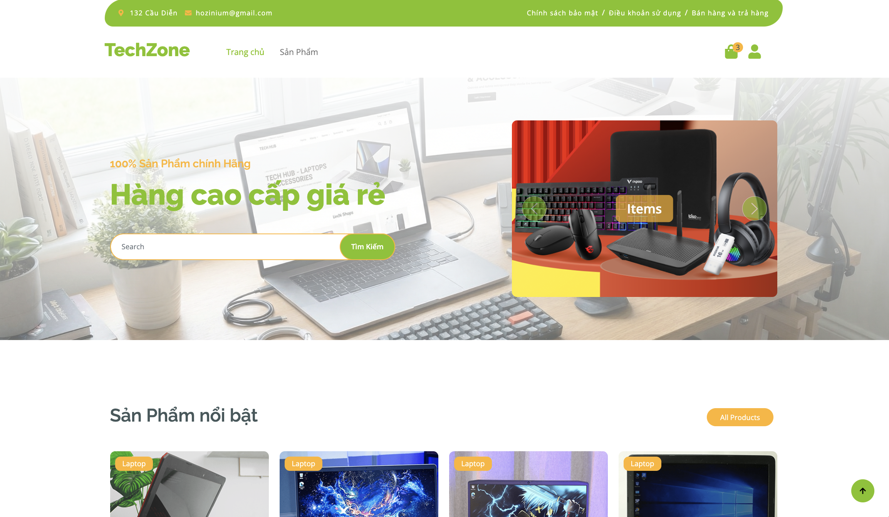
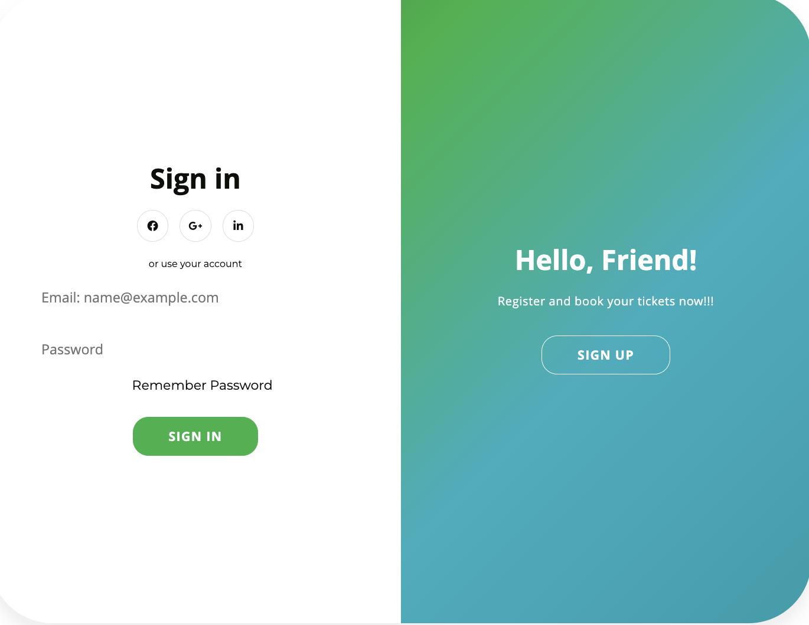
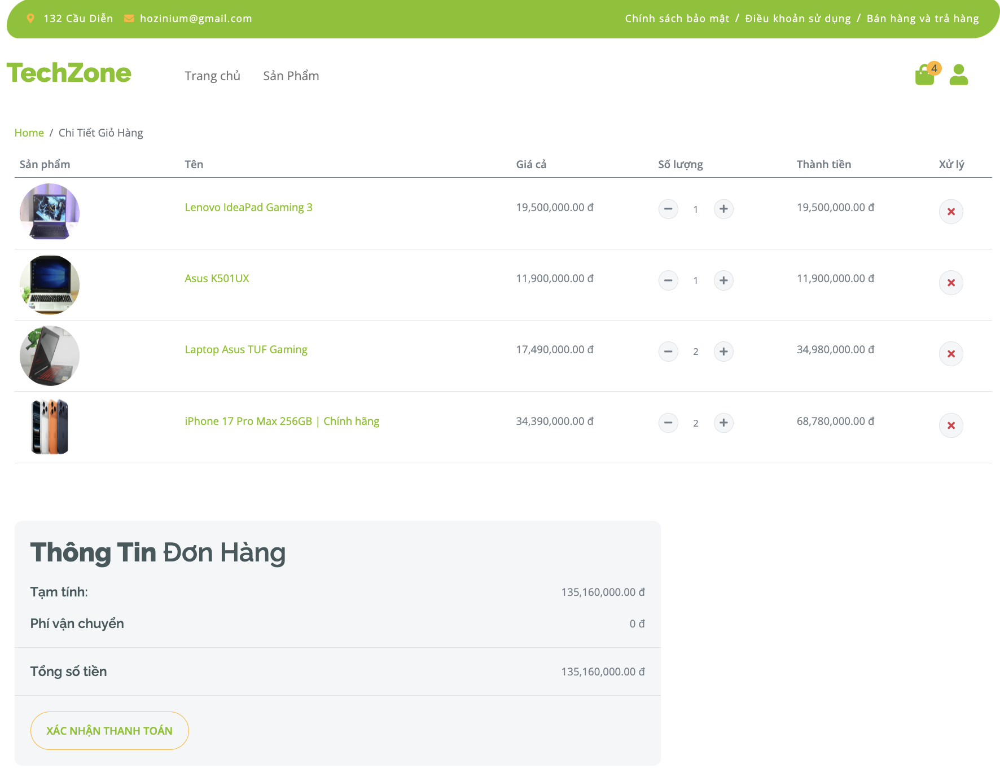
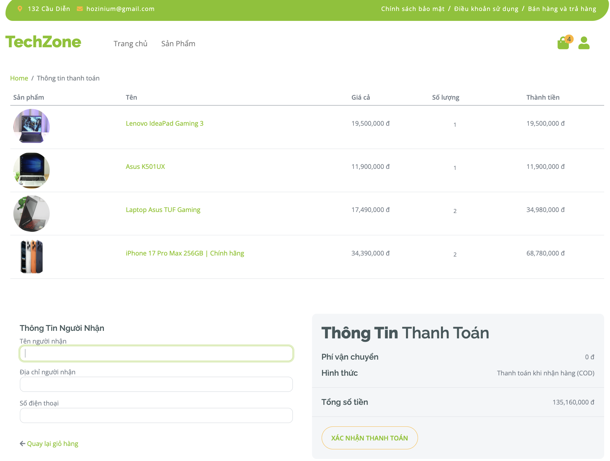
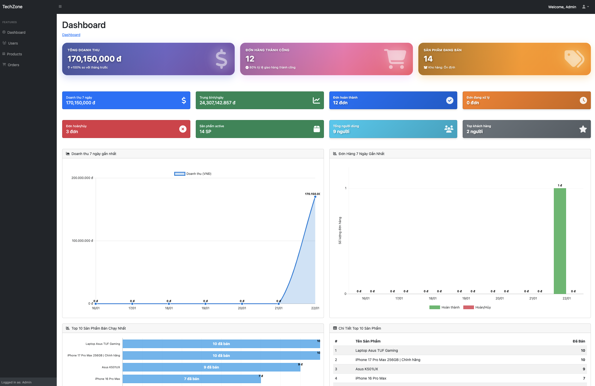

# 🛒 LaptopShop - E-commerce Website

Một website thương mại điện tử bán laptop được xây dựng với Spring Boot và JSP.

## 📸 Screenshots

### 🏠 Trang Chủ


### 🔐 Đăng Nhập


### 📦 Danh Sách Sản Phẩm


### 🛒 Giỏ Hàng


### 💳 Thanh Toán


### 📊 Admin Dashboard


### 🚫 Trang Từ Chối Truy Cập


---

## 📝 Mô Tả Dự Án

### Tính năng:
- Thực hiện CRUD cho Products, Users, Orders, Brands, Categories với validation.
- Phát triển xác thực người dùng và phân quyền dựa trên role sử dụng Spring Security.
- Xây dựng phân trang và lọc động để tìm kiếm sản phẩm theo nhiều tiêu chí (khoảng giá, hãng, mục tiêu) với JPA Specification.
- Triển khai chức năng giỏ hàng với thêm/cập nhật/xóa sản phẩm và quy trình thanh toán.
- Phát triển hệ thống quản lý đơn hàng với theo dõi trạng thái (PENDING, SHIPPING, COMPLETE, CANCELLED, RETURNED).
- Xây dựng Admin Dashboard với phân tích doanh thu, thống kê đơn hàng, top 10 khách hàng và biểu đồ sản phẩm bán chạy.
- Thiết kế kiến trúc clean theo các lớp Service, Repository và Controller.
- Áp dụng best practices trong xử lý ngoại lệ (`@ControllerAdvice`), DTO mapping, validation và custom validators.
- Áp dụng Builder Pattern (Lombok) để tạo các entity và DTO phức tạp.

---

## 🛠️ Công Nghệ Sử Dụng

### Frontend:
- HTML, CSS, JavaScript
- Bootstrap, jQuery, Ajax
- JSP/JSTL

### Backend:
- Java 25
- Spring Boot 4.0
- Spring MVC
- Spring Data JPA
- Hibernate
- Spring Security
- Spring Session JDBC

### Database:
- MySQL

### Tools:
- Maven
- Lombok
- Git

---

## 🚀 Cài Đặt & Chạy

### Yêu cầu:
- Java 25+
- Maven 3.9+
- MySQL 8.0+

### Bước 1: Clone repository
```bash
git clone https://github.com/hoinguyen2704/LaptopShop.git
cd LaptopShop
```

### Bước 2: Cấu hình database
Tạo database MySQL và cập nhật file `application.properties`:
```properties
spring.datasource.url=jdbc:mysql://localhost:3306/laptopshop
spring.datasource.username=your_username
spring.datasource.password=your_password
```

### Bước 3: Import dữ liệu mẫu
```bash
mysql -u your_username -p laptopshop < dataLaptop.sql
```

### Bước 4: Chạy ứng dụng
```bash
mvn spring-boot:run
```

### Bước 5: Truy cập
- **Website:** http://localhost:8080
- **Admin:** http://localhost:8080/admin

---

## 👤 Tác Giả

**Hozinium**

---

## 📄 License

MIT License
